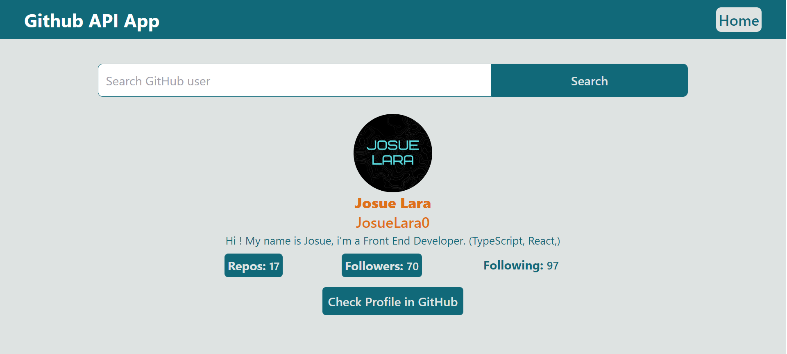
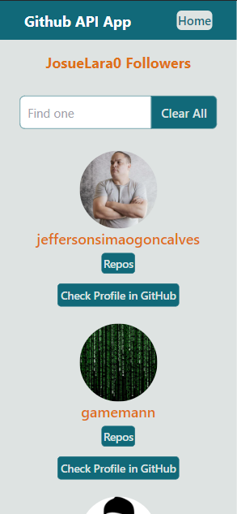

# Github Searcher

Search for a user on the GitHub API and show his followers and repos.

Includes:

1.  Main page with searcher.
2.  View with followers.
3.  View with repos.
4.  Responsive design.

# Deployment

VERCEL:

[LINK](https://github-api-app-ten.vercel.app/)

## Screenshots

Desktop version:

Mobile version:

## Libraries

1.  [REACT](https://en.reactjs.org/)
2.  [REACT ROUTER](https://reactrouter.com/)
3.  [TAILWIND CSS](https://tailwindcss.com/docs/guides/create-react-app)

## Install and run project

1. Clone repo.
2. Install modules `npm install`.
3. Setting up Tailwind CSS (check documentation link).
4. Run project `npm start`.
